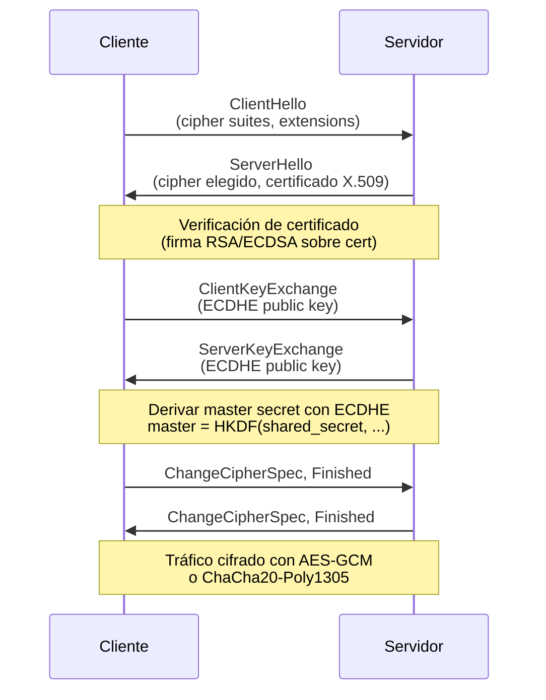

# Deployment Guide – HTTPS con TLS (Clase 12)

Esta guía explica cómo habilitar **TLS/HTTPS** en la API Flask para cumplir con la Clase 12 del curso TEL252.

---

## ¿Por qué TLS?

**Sin TLS (HTTP):**
- ❌ Session tokens viajan en plaintext (Authorization header visible)
- ❌ Metadata visible (sender, recipient, timestamps en AAD)
- ❌ Vulnerable a man-in-the-middle en red pública

**Con TLS (HTTPS):**
- ✅ Todo el tráfico HTTP cifrado (AES-GCM o ChaCha20-Poly1305 a nivel transporte)
- ✅ Autenticación del servidor (certificado X.509)
- ✅ Protección contra MITM en el canal

**Nota:** TLS NO reemplaza E2EE. Son capas complementarias:
- **TLS:** Protege el transporte (cliente ↔ servidor)
- **E2EE:** Protege el contenido (Alice ↔ Bob), incluso si el servidor es comprometido

---

## Opción 1: Certificado Self-Signed (Development)

### Paso 1: Generar Certificado con OpenSSL

```pwsh
# En PowerShell (Windows)
cd C:\Users\Cris\Desktop\e2e_chat

# Generar clave privada y certificado (válido por 365 días)
openssl req -x509 -newkey rsa:4096 -nodes `
  -keyout certs/server.key `
  -out certs/server.crt `
  -days 365 `
  -subj "/C=CL/ST=Valparaiso/L=Valparaiso/O=UTFSM/OU=TEL252/CN=localhost"
```

**Parámetros explicados:**
- `-x509`: Certificado autofirmado (no CA intermedia)
- `-newkey rsa:4096`: Generar nueva clave RSA de 4096 bits
- `-nodes`: No encriptar clave privada con passphrase
- `-keyout`: Archivo de clave privada
- `-out`: Archivo de certificado público
- `-days 365`: Validez de 1 año
- `-subj`: Subject Distinguished Name (información del certificado)

### Paso 2: Correr Flask con TLS

```pwsh
# Opción A: Directamente con Flask
$env:FLASK_APP = "app.server:create_app()"
flask run --cert certs/server.crt --key certs/server.key --port 5000

# Opción B: Con Python
python -c "from app.server import create_app; app = create_app(); app.run(ssl_context=('certs/server.crt', 'certs/server.key'), port=5000)"
```

### Paso 3: Acceder con HTTPS

```pwsh
# Desde PowerShell
curl.exe -k https://127.0.0.1:5000/health
```

**Nota:** `-k` (insecure) desactiva verificación del certificado porque es self-signed.

**En el navegador:**
- Ir a `https://127.0.0.1:5000/health`
- Verás advertencia "Your connection is not private"
- Click "Advanced" → "Proceed to localhost (unsafe)"
- Esto es normal para certificados self-signed en development

### Paso 4: Configurar Cliente para Usar HTTPS

```python
# En clients/service.py
client = E2EEChatClient(
    base_url="https://127.0.0.1:5000",  # Cambiar http → https
    timeout=10.0
)

# En clients/web_app.py
client = E2EEChatClient(
    base_url=os.environ.get("E2E_CHAT_API_BASE", "https://127.0.0.1:5000")
)
```

**Si usas `requests` con self-signed cert:**

```python
import requests

# Opción 1: Deshabilitar verificación (solo development!)
response = requests.post(
    "https://127.0.0.1:5000/register",
    json={...},
    verify=False  # ⚠️ NO usar en producción
)

# Opción 2: Especificar certificado
response = requests.post(
    "https://127.0.0.1:5000/register",
    json={...},
    verify="certs/server.crt"  # Verificar con nuestro cert
)
```

---

## Opción 2: Let's Encrypt (Production)

Para despliegue público (no localhost), usar Let's Encrypt para certificados gratuitos y válidos.

### Requisitos:

- Dominio público (ej: `tel252-chat.example.com`)
- Servidor con IP pública
- Puerto 80 abierto para validación ACME

### Paso 1: Instalar Certbot

```bash
# En servidor Linux (Ubuntu/Debian)
sudo apt update
sudo apt install certbot
```

### Paso 2: Obtener Certificado

```bash
sudo certbot certonly --standalone -d tel252-chat.example.com
```

**Archivos generados:**
- Certificado: `/etc/letsencrypt/live/tel252-chat.example.com/fullchain.pem`
- Clave privada: `/etc/letsencrypt/live/tel252-chat.example.com/privkey.pem`

### Paso 3: Configurar Flask con Let's Encrypt

```python
# En app/server.py
if __name__ == "__main__":
    application = create_app()
    ssl_context = (
        "/etc/letsencrypt/live/tel252-chat.example.com/fullchain.pem",
        "/etc/letsencrypt/live/tel252-chat.example.com/privkey.pem"
    )
    application.run(host="0.0.0.0", port=443, ssl_context=ssl_context)
```

**Nota:** Puerto 443 requiere privilegios de root:

```bash
sudo python app/server.py
```

---

## Opción 3: Nginx Reverse Proxy (Recomendado para Producción)

Usar Nginx como proxy inverso para manejar TLS y dejar Flask sin TLS.

### Ventajas:

- Nginx optimizado para TLS (mejor performance)
- Fácil configuración de HSTS, OCSP stapling, etc.
- Flask corre sin privilegios elevados

### Configuración Nginx:

```nginx
# /etc/nginx/sites-available/tel252-chat

server {
    listen 443 ssl http2;
    server_name tel252-chat.example.com;

    # Certificados Let's Encrypt
    ssl_certificate /etc/letsencrypt/live/tel252-chat.example.com/fullchain.pem;
    ssl_certificate_key /etc/letsencrypt/live/tel252-chat.example.com/privkey.pem;

    # Configuración TLS moderna (TLS 1.2+)
    ssl_protocols TLSv1.2 TLSv1.3;
    ssl_ciphers 'ECDHE-RSA-AES128-GCM-SHA256:ECDHE-RSA-AES256-GCM-SHA384:ECDHE-RSA-CHACHA20-POLY1305';
    ssl_prefer_server_ciphers on;

    # HSTS (HTTP Strict Transport Security)
    add_header Strict-Transport-Security "max-age=31536000; includeSubDomains" always;

    # Proxy hacia Flask (HTTP interno)
    location / {
        proxy_pass http://127.0.0.1:5000;
        proxy_set_header Host $host;
        proxy_set_header X-Real-IP $remote_addr;
        proxy_set_header X-Forwarded-For $proxy_add_x_forwarded_for;
        proxy_set_header X-Forwarded-Proto $scheme;
    }
}

# Redirect HTTP → HTTPS
server {
    listen 80;
    server_name tel252-chat.example.com;
    return 301 https://$server_name$request_uri;
}
```

**Habilitar sitio:**

```bash
sudo ln -s /etc/nginx/sites-available/tel252-chat /etc/nginx/sites-enabled/
sudo nginx -t  # Verificar configuración
sudo systemctl reload nginx
```

**Flask corre en HTTP interno:**

```bash
flask --app app.server:create_app() run --host 127.0.0.1 --port 5000
```

---

## Opción 4: ngrok (Testing Público Temporal)

Para probar HTTPS sin configurar dominio/servidor.

### Paso 1: Instalar ngrok

```pwsh
# Windows
winget install -e --id ngrok.ngrok

# O descargar desde https://ngrok.com/download
```

### Paso 2: Exponer Flask al Internet

```pwsh
# Terminal 1: Correr Flask en HTTP
flask --app app.server:create_app() run --port 5000

# Terminal 2: Exponer con ngrok
ngrok http 5000
```

**Output:**

```
Forwarding  https://abc123.ngrok.io -> http://127.0.0.1:5000
```

**Ahora puedes acceder:**
- Desde cualquier lugar: `https://abc123.ngrok.io`
- ngrok maneja el TLS automáticamente (certificado válido de ngrok)
- Útil para testing desde móvil o con compañeros de grupo

**Advertencia:** La URL cambia cada vez que reinicias ngrok (gratuito). Para URL fija, necesitas cuenta paga.

---

## Verificar TLS con OpenSSL

```pwsh
# Verificar certificado y cipher suite
openssl s_client -connect 127.0.0.1:5000 -showcerts

# Ver solo cipher usado
openssl s_client -connect 127.0.0.1:5000 -brief
```

**Output esperado:**

```
Protocol version: TLSv1.3
Ciphersuite: TLS_AES_256_GCM_SHA384
Peer certificate: CN = localhost
Hash used: SHA256
Signature type: RSA-PSS
Verification: self-signed certificate (OK for dev)
```

---

## Verificar TLS en Wireshark

1. Capturar tráfico HTTPS (puerto 443 o 5000)
2. Filtro: `ssl.handshake.type == 1` (ClientHello)
3. Verás:
   - **Handshake completo:** ClientHello, ServerHello, Certificate, ServerKeyExchange
   - **Application Data:** Cifrado con TLS (no legible sin clave privada)

4. Para descifrar en Wireshark (solo con cert self-signed):
   - Edit → Preferences → Protocols → TLS
   - RSA keys list → Add:
     - IP: `127.0.0.1`
     - Port: `5000`
     - Protocol: `http`
     - Key file: `C:\Users\Cris\Desktop\e2e_chat\certs\server.key`

5. Recargar captura → Verás HTTP descifrado (pero ciphertext E2EE sigue siendo indescifrable)

---

## Fundamento Teórico (Clase 12)

### Protocolo TLS 1.3 Handshake



### Cipher Suites Recomendados (TEL252)

| Cipher Suite | Key Exchange | Cifrado | MAC |
|--------------|--------------|---------|-----|
| `TLS_ECDHE_RSA_WITH_CHACHA20_POLY1305_SHA256` | ECDHE (Clase 7) | ChaCha20 (Clase 2) | Poly1305 (Clase 11) |
| `TLS_ECDHE_RSA_WITH_AES_256_GCM_SHA384` | ECDHE | AES-GCM (Clase 3) | GCM (Clase 11) |
| `TLS_AES_256_GCM_SHA384` (TLS 1.3) | Implícito (ECDHE) | AES-GCM | GCM |

**Todos usan primitivas vistas en TEL252!**

---

## Testing de Seguridad TLS

### Test 1: Verificar TLS 1.3

```pwsh
# Solo aceptar TLS 1.3
openssl s_client -connect 127.0.0.1:5000 -tls1_3

# Debería conectar. Si falla, Flask no está usando TLS 1.3
```

### Test 2: Rechazar TLS 1.0/1.1 (Inseguros)

```pwsh
# Intentar TLS 1.0 (debería fallar)
openssl s_client -connect 127.0.0.1:5000 -tls1

# Output esperado: "no protocols available" o "handshake failure"
```

### Test 3: Verificar Forward Secrecy

```pwsh
openssl s_client -connect 127.0.0.1:5000 -cipher 'ECDHE'

# Debería usar cipher con ECDHE (ephemeral keys)
# Forward secrecy: Compromiso de server key NO compromete sesiones pasadas
```

---

## Configuración Segura de Python Flask

```python
# app/server.py
import ssl

def create_app(storage=None):
    app = Flask(__name__)
    # ... rutas ...
    return app

if __name__ == "__main__":
    application = create_app()
    
    # Crear contexto SSL/TLS seguro
    ssl_context = ssl.SSLContext(ssl.PROTOCOL_TLS_SERVER)
    ssl_context.load_cert_chain('certs/server.crt', 'certs/server.key')
    
    # Solo TLS 1.2+
    ssl_context.minimum_version = ssl.TLSVersion.TLSv1_2
    
    # Cipher suites seguros (prioritize ChaCha20-Poly1305 para TEL252)
    ssl_context.set_ciphers('ECDHE+CHACHA20:ECDHE+AESGCM:ECDHE+AES')
    
    application.run(
        host="0.0.0.0",
        port=5000,
        ssl_context=ssl_context,
        debug=False  # ⚠️ NUNCA debug=True en producción
    )
```

---

## Resumen de Beneficios TLS

| Sin TLS (HTTP) | Con TLS (HTTPS) |
|----------------|-----------------|
| Session tokens visibles en Wireshark | Session tokens cifrados |
| AAD metadata legible | AAD metadata cifrada |
| Vulnerable a MITM | Protegido contra MITM |
| Solo E2EE (1 capa) | E2EE + TLS (2 capas - defense in depth) |

**Nota importante:** Incluso con TLS comprometido (ej: atacante tiene `server.key`), el E2EE protege los mensajes porque:
- TLS descifra el canal HTTP → Revela `ciphertext` (Base64)
- `ciphertext` está cifrado con ChaCha20-Poly1305 usando `shared_key`
- `shared_key` deriva de X25519 ECDH, nunca viaja por red
- Atacante NO tiene `identity_private` de Alice o Bob → NO puede derivar `shared_key`

**Resultado:** TLS + E2EE = Protección robusta end-to-end
