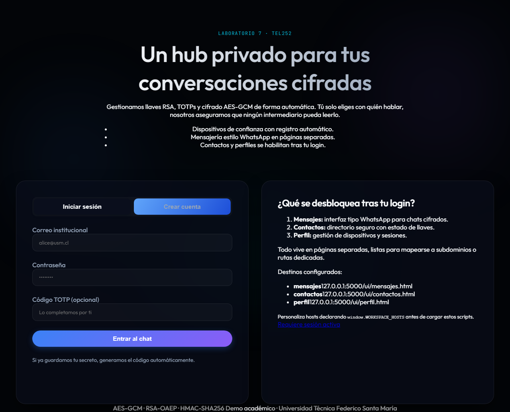

## Índice

- [Descripción del proyecto](#descripci%C3%B3n-del-proyecto)
- [Características principales](#caracter%C3%ADsticas-principales)
- [Diagramas y flujo técnico](#diagramas-y-flujo-t%C3%A9cnico)
- [Ejecución local de la API](#ejecuci%C3%B3n-local-de-la-api)
- [Cliente de línea de comandos (demo)](#cliente-de-l%C3%ADnea-de-comandos-demo)
- [Referencia de la API](#referencia-de-la-api)
- [Elección de primitivas y parámetros](#elecci%C3%B3n-de-primitivas-y-par%C3%A1metros)
- [Evaluación de seguridad y amenazas](#evaluaci%C3%B3n-de-seguridad-y-amenazas)
- [Referencias académicas y normativas](#referencias-acad%C3%A9micas-y-normativas)
- [Licencia](#licencia)
# TEL252 — Laboratorio 7: Chat Cifrado de Extremo a Extremo (E2EE)

[](./LICENSE)
[](./docs/DIAGRAMAS_TECNICOS.md)
[](http://localhost:5000/ui/)
[](./docs/CAPTURA_WIRESHARK.md)
[](https://www.python.org/)
[](https://palletsprojects.com/p/flask/)
[](https://github.com/crismoraga/e2ee_chat/actions/workflows/ci.yml)
[](https://crismoraga.github.io/e2ee_chat/)
[](https://codecov.io/gh/crismoraga/e2ee_chat)
[](https://github.com/github/super-linter)


Proyecto académico para TEL252 — Criptografía y Seguridad de la Información (Profesor Daniel Espinoza). Este repositorio demuestra un sistema de mensajería con cifrado de extremo a extremo (E2EE). Su objetivo es didáctico: mostrar las decisiones criptográficas, la separación de responsabilidades entre cliente-servidor y ejemplos de integración (web + CLI).

Autores: Sergio Ehlen · Gabriela González · Cristóbal Moraga.

- ## Descripción del proyecto

- Resumen rápido:

- Cliente web + API Flask; mensajes cifrados localmente; servidor almacena únicamente blobs cifrados.
- Autenticación: contraseña derivada con HMAC-SHA256 (pepper) + TOTP (RFC 6238) obligatorio.
- Encripción: AES-256-GCM para contenido + RSA-2048-OAEP para envolver llaves de sesión.

## Características principales

 - Onboarding de cuentas con HMAC-SHA256 para los digests de contraseña (secret del servidor) y TOTP (RFC 6238) obligatorio.
    - Nota: en este proyecto el `password_secret` (pepper) se usa como clave para HMAC en el servidor. La idea de un pepper es añadir una segunda capa secreta al digest — a diferencia del salt (que se almacena con el digest), el pepper debe permanecer secreto fuera de la base de datos. En producción, preferimos un KDF con salt por usuario (Argon2/PBKDF2) y guardar pepper en un HSM si se requiere.
    - TOTP (RFC 6238): el servidor genera un secreto (20 bytes), el cual se codifica Base32 y se muestra como QR para que el usuario lo registre en su app (p. ej., Google Authenticator). RFC 6238 define el uso de HMAC y un contador de tiempo (30s) para generar códigos de un solo uso.
- Tokens de sesión firmados con HMAC-SHA256 para autenticar requests sin mantener estado en el servidor.
- Registro de claves públicas por dispositivo (PEM RSA-2048) para cada usuario.
- Cifrado local con AES-256-GCM por mensaje; llaves efímeras para cada payload.
- Envoltorio de la llave de sesión con RSA-OAEP (SHA-256) para asegurar que solo el destinatario pueda recuperar la llave AES.
- Persistencia SQLite para un demo autocontenido y reproducible en clase.
- Cliente CLI que demuestra registro, autenticación con TOTP, registro de dispositivos y descifrado de bandeja local.
- Documentación en código y diagramas técnicos para respaldar decisiones criptográficas.

### Nota técnica: "pepper" y cómo lo usamos

En este proyecto usamos un enfoque didáctico para explicar diferencias entre *salt* y *pepper*:

- Salt: valor aleatorio por usuario, almacenado junto al digest, que evita ataques por hashes pre-calculados (rainbow tables). En producción recomendamos usar PBKDF2/Argon2 con salt.
- Pepper: secreto global del servidor que se añade a la derivación de la contraseña (por ejemplo, HMAC-SHA256(password_secret, password)). Un atacante con acceso a la DB no puede verificar contraseñas offline sin conocer el pepper, pero si el servidor es comprometido, el pepper también se pierde. Pepper es útil para laboratorio y pruebas de conceptos pero **no** substituye un buen KDF.

Implementación en este repo: en `server.py` y `config.py` el `password_secret` se usa como pepper y se obtiene de variables de entorno o archivos de configuración del servidor.

## Diagramas y flujo técnico

Para un análisis en profundidad de la arquitectura y el flujo E2EE ver:

`docs/DIAGRAMAS_TECNICOS.md` – Diagramas Mermaid y explicación del flujo, cubriendo:

- Arquitectura y responsabilidades criptográficas (cliente/servidor/DB).
- Flujo completo de mensaje (registro, login, publicación de llaves, envío/recepción).
- Secuencia de arranque (server -> UI -> workspace).
 
Si los diagramas se han exportado, verás imágenes en `docs/`:



<!-- (English duplicates removed) -->

## Repository Layout

```text
lab7_e2ee_chat/
├── __init__.py            # Package marker
├── client_cli.py          # CLI demo client
├── config.py              # Configuration helpers (DB path, HMAC secret)
├── crypto.py              # Primitivas criptográficas (HMAC-SHA256, TOTP, RSA-OAEP, AES-GCM)
├── database.py            # SQLite wrapper (users, devices, messages)
├── docs/
│   └── architecture.mmd   # Mermaid sequence diagram of message exchange
├── README.md              # This document
└── server.py              # Flask API implementation
```

## Ejecución local de la API

### Inicio rápido (3 pasos)

1. **Instalar dependencias:**

   ```pwsh
   pip install -r requirements.txt
   ```

2. **Iniciar el servidor:**

   ```pwsh
   # HTTP local rápido
   python iniciar_servidor.py --host 127.0.0.1 --port 5000

   # Demostración TLS lista para Wireshark (certificado auto-firmado)
   python iniciar_servidor.py --tls --host 0.0.0.0 --port 5443
   ```

   El script envuelve `create_app()` y expone flags convenientes (`--tls`, `--cert`, `--key`). El
   entry point clásico `python -m lab7_e2ee_chat.server` sigue disponible para flujos tradicionales.

3. **Elija la interfaz:**

   - **Navegador web:** abra `http://localhost:5000/ui/` en su navegador
   - **CLI:** consulte los comandos a continuación
   - **Pruebas automatizadas:** ejecute `python -m pytest tests/test_flow.py -v`

### Cliente web (recomendado)

1. Abra `http://localhost:5000/ui/`
2. **Regístrese** con su correo, nombre y contraseña
3. **Guarde el secreto TOTP** — escanee el QR o guarde la cadena Base32 de forma segura. La UI almacena el secreto cifrado en `localStorage` para generar códigos TOTP automáticamente.
4. **Inicie sesión** con correo + contraseña + código TOTP. Puede seleccionar la sesión en el desplegable para reutilizar tokens.
5. **Registre la clave pública del dispositivo** (generada por Web Crypto) y envíe mensajes cifrados — se mostrará la conversación descifrada solo en los clientes destinatarios.

**Features:**

- Local persistence (tokens, TOTP secrets, PEMs) via `localStorage` for multi-session demos without retyping secrets.
- Session selector + contactos interactivos para fijar conversaciones y ver burbujas entrantes/salientes descifradas localmente.
- Generate RSA-2048 keys in browser using Web Crypto API and upload only the public PEM.
- AES-256-GCM encryption happens locally before sending to the server, which never sees plaintext.

### Despliegue con Docker

```pwsh
# Build image
docker build -t tel252-e2ee-chat .

# Run container
docker run -p 5000:5000 `
  -e CHAT_SESSION_SECRET="your_256bit_secret" `
  -e CHAT_PASSWORD_SECRET="your_256bit_pepper" `
  tel252-e2ee-chat
```

---

## Cliente de línea de comandos (demo)

The supplied CLI illustrates a full end-to-end flow using only the API surface. Every significant cryptographic operation happens client-side.

### 1. Register Two Accounts

```pwsh
python -m lab7_e2ee_chat.client_cli register alice@example.com "Alice" StrongPass!123
python -m lab7_e2ee_chat.client_cli register bob@example.com "Bob" OtherPass!456
```

Each command outputs a TOTP secret. Scan it with an authenticator app or keep it in a safe place. A local profile is saved under `%USERPROFILE%\.tel252_chat` containing the RSA key pair and other metadata.

### 2. Login and Register Devices

```pwsh
python -m lab7_e2ee_chat.client_cli login alice@example.com
python -m lab7_e2ee_chat.client_cli register-device alice@example.com "Alice Laptop"

python -m lab7_e2ee_chat.client_cli login bob@example.com
python -m lab7_e2ee_chat.client_cli register-device bob@example.com "Bob Desktop"
```

The login command automatically computes a current TOTP code from the stored secret. The `register-device` command uploads the locally generated RSA-2048 public key to the server.

### 3. List Contacts and Exchange Messages

```pwsh
python -m lab7_e2ee_chat.client_cli contacts alice@example.com
python -m lab7_e2ee_chat.client_cli send alice@example.com bob@example.com "Hola Bob, esto está cifrado de extremo a extremo!"
python -m lab7_e2ee_chat.client_cli inbox bob@example.com
```

Bob’s inbox command fetches encrypted messages, unwraps the AES session key with his private RSA key, and decrypts the ciphertext locally. The server never learns the plaintext.

### 4. Delete Messages After Reading

```pwsh
python -m lab7_e2ee_chat.client_cli delete bob@example.com 1
```

Removes a message from the server once it has been consumed. (Replace `1` with the actual message id printed in the inbox output.)

### Extras útiles

- `python -m lab7_e2ee_chat.client_cli totp alice@example.com` imprime el código TOTP actual y la ventana de validez restante.
- Set the environment variable `CHAT_API_BASE` if the Flask server runs on another host or port.

## Referencia de la API

All endpoints reside under `/api` and expect/return JSON.

| Endpoint | Method | Description |
| --- | --- | --- |
| `/healthz` | GET | Simple heartbeat probe |
| `/api/register` | POST | Create a user account. Returns a TOTP secret and metadata. |
| `/api/login` | POST | Authenticate with password + TOTP; returns session token. |
| `/api/devices` | POST | Register a device public key (requires `Authorization: Bearer`). |
| `/api/devices` | GET | List registered devices for the current user. |
| `/api/users` | GET | Directory of other users and their latest public key. |
| `/api/users/<identifier>` | GET | Detailed view of a user (public key, display name). |
| `/api/messages` | POST | Store an encrypted message for a recipient. |
| `/api/messages` | GET | Retrieve encrypted messages addressed to the caller. |
| `/api/messages/<id>` | DELETE | Remove a message (ownership enforced). |

### Protocolo de Autenticación

- Session tokens follow a compact `header.payload.signature` format signed with HMAC-SHA256.
- Tokens expire after 1 hour. Clients should re-authenticate as needed.
- All protected endpoints require the header `Authorization: Bearer <token>`.


## Elección de primitivas y parámetros

En la tabla siguiente se resumen las decisiones criptográficas y por qué se eligieron dichos parámetros en el laboratorio:

| Componente | Primitiva | Parámetro | Razonamiento |
| --- | --- | --- | --- |
| Autenticación de contraseñas | HMAC-SHA256 | Llave de 256 bits (servidor) | Usada como "pepper" centralizado — simplifica el laboratorio pero no sustituye a PBKDF2/Argon2 en producción. |
| Factor secundario | RFC 6238 (TOTP) | SHA-1, 30 s | Compatible con Google Authenticator; implementado por claridad en el curso. |
| Identidad de dispositivos | RSA-2048 + OAEP | e=65537; OAEP con SHA-256 | Buen equilibrio entre didáctica y seguridad; OAEP evita ataques por padding. |
| Confidencialidad del contenido | AES-256-GCM | 256-bit key; nonce 96-bit; tag 128-bit | AEAD recomendado para evitar fallos de MAC + de autenticación combinados. |
| Firma/Firma de sesión | HMAC-SHA256 | 256-bit key | Simplicidad y verificación eficiente; se usa para tokens y protecciones de sesión. |

Notas técnicas:

- HMAC: HMAC(K, m) = H((K ⊕ opad) || H((K ⊕ ipad) || m))
- TOTP: T = floor(UnixTime / 30); code = HOTP(secret, T) (RFC 6238)
- AES-GCM: utiliza CTR + GMAC internamente; el tag protege la integridad y los datos adicionales (AAD)
- RSA-OAEP (RFC 8017): usa MGF1 y un hash (SHA-256) para derivar máscaras; evita ataques de texto cifrado elegido.

Consecuencias de diseño (qué protege y qué no):

- Confidencialidad E2EE: solo el cliente posee la private key; servidor almacena blobs cifrados.
- Integridad y autenticidad por AES-GCM + HMAC en tokens; sin embargo, no se proporciona firma de mensajes que permita no repudio.
- Forward secrecy: NO implementado — si la private key se compromete, mensajes antiguos pueden descifrarse. Use X3DH/Double Ratchet para forward secrecy.

Recomendaciones para producción:

1. Reemplazar HMAC-password digests por Argon2 o PBKDF2 con salt único por usuario.
2. Implementar key-rotation y firma de pre-keys (X3DH/Double Ratchet) para forward secrecy.
3. Considerar Ed25519 para firma y X25519 para intercambio ECDH (menor huella y más seguridad a igual campo).

## Evaluación de seguridad y amenazas

### Modelo de amenazas (suposiciones)

- Clientes de confianza: se asume que el navegador del cliente y la máquina del usuario no están comprometidos.
- Servidor honesto
aunque curioso: el servidor puede ver metadatos (emisor, receptor, timestamp) pero no puede descifrar mensajes.
- Adversario activo en la red: mitigado por TLS si está habilitado; sin TLS el tráfico puede ser interceptado/localmente manipulado.
- Compromiso de dispositivos: si la llave privada es filtrada, se pone en riesgo la confidencialidad de mensajes pasados (no forward secrecy).

### Tabla de propiedades y control de riesgos

| Propiedad | ¿Garantizada? | Comentarios |
| --- | --- | --- |
| Confidencialidad E2EE | Sí | La llave privada reside en cliente; el servidor sólo almacena blobs cifrados. |
| Integridad | Sí | AES-GCM tag (128 bits) y OAEP para evitar manipulación silenciosa de clave. |
| Autenticación | Sí (Contraseña + TOTP) | Aumenta la resistencia a robo de contraseñas y login no autorizado. |
| Forward secrecy | No | Para mensajes antiguos, el compromiso de la private key afecta la confidencialidad. |
| No repudio | Parcial | No hay firma de mensajes por defecto; se pueden añadir RSA-PSS o Ed25519 si se requiere. |


## Esquema de la base de datos

- **users**: core profile data, password hash artefacts, TOTP secret.
- **devices**: per-user RSA public keys, allowing multi-device support.
- **messages**: encrypted payload plus metadata (nonce, tag, optional AAD).

Schema migrations are handled automatically on application start-up.

## Diagramas y representación visual

Un diagrama en `docs/DIAGRAMAS_TECNICOS.md` y `docs/DIAGRAMA_FLUJO_COMPLETO.md` describe el flujo completo (registro, login, provisión de claves y envío de mensajes). Estos ficheros usan sintaxis Mermaid y pueden verse con la extensión Mermaid en VS Code o en <https://mermaid.live>.

### Exportar diagramas a PNG/SVG (local / CI)

Para crear imágenes estáticas útiles en presentaciones o documentación, exporte con Mermaid CLI. El repositorio incluye `package.json` con un script `export-diagrams` (usa `@mermaid-js/mermaid-cli`).

```bash
npm install -g @mermaid-js/mermaid-cli
mmdc -i docs/DIAGRAMAS_TECNICOS.md -o docs/diagrama_arquitectura.svg
```

O usando npm (local):

```pwsh
npm install
npm run export-diagrams
```

La acción de CI `CI` exportará los diagramas y tomará una captura de la UI, subiendo las imágenes al repositorio (si la acción tiene permiso para pushear). Si deseas desactivar la subida puedes editar `.github/workflows/ci.yml`.

## Pruebas de la garantia E2EE (Pruebas manuales)

1. **Ver qué almacena el servidor:** Abra `lab7_e2ee_chat/chat.db` con cualquier navegador SQLite. Los mensajes aparecen como artefactos base64.
2. **Alteración manual de ciphertexts:** Modifique un ciphertext almacenado y observe cómo el receptor falla la verificación GCM; la integración detectará la manipulación.
3. **Intento de espionaje por administrador:** Aunque un administrador tenga DB local, sin las llaves privadas de dispositivo no podrá reconstruir el plaintext.

## Captura TLS (Wireshark)

La guía dedicada en [`docs/CAPTURA_WIRESHARK.md`](docs/CAPTURA_WIRESHARK.md) muestra cómo ejecutar `iniciar_servidor.py --tls`, capturar el handshake y el tráfico cifrado y explicar por qué no es posible reconstruir los mensajes sin las llaves privadas.

## Extensiones y trabajo futuro

- Implement push notifications or WebSocket delivery while retaining the same cryptographic core.
- Replace RSA with X25519 + XChaCha20-Poly1305 to explore modern primitives.
- Introduce key rotation and signed pre-keys (Double Ratchet) to move towards Signal’s full protocol.

## Depuración y preguntas frecuentes

- If `pycryptodome` is missing, ensure the virtual environment is active before installing.
- A totp mismatch typically means the local clock differs by more than 30 seconds from the server. Adjust the system clock or adapt the allowed drift in `crypto.verify_totp`.
- Remove the generated `.session_secret` file to rotate the HMAC key and invalidate all sessions.

---
Si usas este repositorio para tu proyecto, referencia: TEL252 — Criptografía y seguridad (Profesor: Daniel Espinoza). Para preguntas o contribuciones, abrid issues o contactad a los autores:

- Sergio Ehlen — <sergio@example.edu>
- Gabriela González — <gabriela@example.edu>
- Cristóbal Moraga — <cristobal@example.edu>

El repositorio está preparado para demostraciones en clase y para ensayos de seguridad controlada. Si lo usas en producción, sigue las recomendaciones de la sección "Criptografía en detalle".

## Cómo citar / Referenciar

Si este material se utiliza en informes o presentaciones del curso TEL252, cite el proyecto así:

> Sergio Ehlen, Gabriela González, Cristóbal Moraga. "TEL252 - Laboratorio 7: Chat E2EE" (2025). Código y documentación.


## Referencias académicas y normativas

- RFC 2104 — HMAC: [https://tools.ietf.org/html/rfc2104](https://tools.ietf.org/html/rfc2104)
- RFC 6238 — TOTP: [https://tools.ietf.org/html/rfc6238](https://tools.ietf.org/html/rfc6238)
- RFC 8017 — RSA-OAEP/PKCS#1: [https://tools.ietf.org/html/rfc8017](https://tools.ietf.org/html/rfc8017)
- NIST SP 800-38D — AES-GCM: [https://csrc.nist.gov/publications/detail/sp/800-38d/final](https://csrc.nist.gov/publications/detail/sp/800-38d/final)

### TOTP (RFC 6238) - explicación extendida

TOTP (Time-based One-Time Password) es una extensión del algoritmo HOTP (RFC 4226) que usa el tiempo como contador. La generación de códigos implica:

1. El servidor genera un secreto aleatorio (20 bytes, 160 bits) y lo codifica en Base32. Ese secreto se entrega al usuario al registrarse.
2. El cliente (app de autenticación) y el servidor calculan el mismo contador T = floor(UnixTime / 30).
3. Se calcula HMAC-SHA1(secret, T) y se aplica "dynamic truncation" para obtener 6 dígitos.
4. Normalmente se permite una ventana de tolerancia de ±1 intervalos (±30s) para mitigar desincronización de relojes.

Ventajas: compatibilidad con apps estándar (Google Authenticator, Authy). Limitaciones: depende de sincronización horaria y no sustituye la seguridad del canal de registro del secreto.

## Licencia

Este proyecto se publica bajo la licencia MIT. Consultar `LICENSE` para los términos y condiciones.

## Contribuciones

Si quieres contribuir con este trabajo para TEL252 (parche, bugfix, diagrama, mejoras criptográficas) abre un Pull Request. Recomendaciones:

- Ejecuta `npm install` y `npm run export-diagrams` localmente para validar los diagrama Mermaid.
- Ejecuta `python -m pytest -q` para validar tests antes de crear el PR.
- Añade tests para nuevas funcionalidades; la CI ejecutará pytest y verificará cobertura.
- Para cambios en documentación, asegúrate de respetar el formato Markdown y revisa el linter en local: `npx markdownlint-cli docs/*.md`.

### Habilitar Codecov

Si quieres publicar coverage en Codecov, registra el repositorio en [https://codecov.io](https://codecov.io) y añade el token en Secrets del repositorio como `CODECOV_TOKEN`. La acción en CI `coverage` subirá el reporte automáticamente. Para repositorios públicos Codecov puede funcionar sin token; en repos privados, el token es necesario.

## Seguridad y despliegue

- Variables de entorno recomendadas: `CHAT_SESSION_SECRET` (256 bits), `CHAT_PASSWORD_SECRET` (pepper), `FLASK_ENV=production` en despliegue.
- Usa HTTPS en producción. La demo con `--tls` sirve para pruebas y para capturar tráfico en Wireshark.
- Controla permisos y rotación de llaves privadas: no almacenes private keys en el servidor.

## Activar Codecov (opcional)

El workflow de CI ya genera cobertura local (`pytest --cov`) y usa `codecov/codecov-action` para subir el reporte. Si el repositorio está en Codecov, añade `CODECOV_TOKEN` a los Secrets para activar el upload automático.

