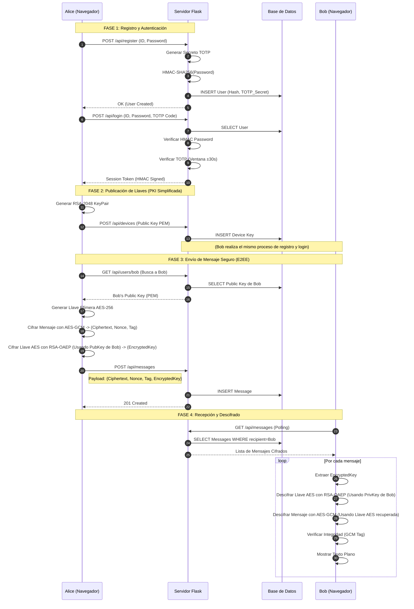

# Documentación Técnica y Diagramas de Flujo - TEL252 Chat E2EE

Este documento detalla la arquitectura de seguridad y el flujo de operación del sistema de chat cifrado de extremo a extremo.

## 1. Arquitectura del Sistema y Criptografía

El siguiente diagrama ilustra los componentes clave del sistema, dónde residen los datos sensibles y qué primitivas criptográficas protegen cada interacción.

```mermaid
graph TD
    subgraph "Cliente (Navegador Web)"
        UI[Interfaz de Usuario<br/>(HTML/CSS/JS)]
        
        subgraph "Memoria Volátil (JS)"
            SessionToken[Token de Sesión<br/>(HMAC-SHA256)]
            PrivKey[Llave Privada RSA-2048<br/>(Nunca sale del cliente)]
            AESKey[Llaves Efímeras AES-256<br/>(Por mensaje)]
        end
        
        subgraph "Operaciones Locales"
            GenKey[Generación de Llaves<br/>RSA-2048]
            Encrypt[Cifrado Híbrido<br/>AES-GCM + RSA-OAEP]
            Decrypt[Descifrado Híbrido]
        end
    end

    subgraph "Canal Inseguro (Internet)"
        HTTP[Peticiones HTTP/JSON]
    end

    subgraph "Servidor (Flask API)"
        AuthLayer[Capa de Autenticación]
        Relay[Relay de Mensajes]
        
        subgraph "Criptografía de Servidor"
            PW_Check[Verificación Password<br/>HMAC-SHA256]
            TOTP_Check[Verificación 2FA<br/>RFC 6238 (SHA1)]
            Token_Sign[Firma de Sesión<br/>HMAC-SHA256]
        end
    end

    subgraph "Base de Datos (SQLite)"
        Users[Tabla: Users<br/>- ID<br/>- Password Hash (HMAC)<br/>- TOTP Secret]
        Devices[Tabla: Devices<br/>- Public Key (PEM)<br/>- Device Name]
        Messages[Tabla: Messages<br/>- Cifrado AES (Base64)<br/>- Llave AES Cifrada (RSA)]
    end

    %% Relaciones
    UI --> GenKey
    GenKey --> PrivKey
    GenKey -->|Public Key| HTTP
    
    UI -->|Login (User, Pass, TOTP)| HTTP
    HTTP --> AuthLayer
    
    AuthLayer --> PW_Check
    AuthLayer --> TOTP_Check
    AuthLayer --> Token_Sign
    
    Token_Sign -->|Token| UI
    
    UI -->|Mensaje Cifrado| HTTP
    HTTP --> Relay
    Relay --> Messages
    
    Devices -->|Public Key| Relay
    Relay -->|Public Key| UI
    
    Users -.-> PW_Check
    Users -.-> TOTP_Check
```

### Detalles de los Componentes

1. **Cliente (Web)**:
    * **Responsabilidad**: Es el único lugar donde existen los datos en texto plano.
    * **Llaves**: Genera el par RSA-2048 al inicio. La llave privada se mantiene en memoria (o IndexedDB) y **nunca** se envía al servidor.
    * **Cifrado**: Utiliza un esquema híbrido. El mensaje se cifra con AES-256-GCM (rápido), y la llave AES se cifra con la llave pública RSA del destinatario (seguro).

2. **Servidor (Flask)**:
    * **Responsabilidad**: Autenticación y almacenamiento "ciego" (Blind Storage).
    * **Zero Knowledge**: El servidor no tiene acceso a las llaves privadas de los usuarios ni a las llaves AES de los mensajes. Solo ve blobs cifrados en Base64.
    * **Autenticación**:
        * **Password**: No se guarda el hash tradicional, sino un HMAC-SHA256 usando un secreto del servidor (`.password_secret`). Esto mitiga ataques de diccionario offline si la DB es robada.
        * **2FA**: Implementación estricta de TOTP (RFC 6238).

3. **Base de Datos**:
    * Almacena metadatos (quién envía, a quién, cuándo) y payloads cifrados.

---

## 2. Flujo de Vida: De Registro a Mensaje

Este diagrama de secuencia detalla paso a paso cómo interactúan los usuarios (Alice y Bob) con el servidor para establecer una comunicación segura.



### Explicación del Flujo

1. **Registro y 2FA**: El servidor genera un secreto TOTP único para Alice. Alice debe configurar su autenticador (Google Auth/Authy) usando el QR generado en el perfil. Sin este código, el login falla.
2. **Gestión de Llaves**: Al iniciar sesión, el navegador de Alice genera un par de llaves RSA. La pública se sube al servidor ("Directorio"), la privada se queda en memoria.
3. **Búsqueda de Contacto**: Para hablar con Bob, Alice pide su llave pública al servidor. El servidor actúa como una Autoridad de Certificación (CA) simplificada.
4. **Cifrado (Envelope Encryption)**:
    * No se usa RSA para cifrar el mensaje entero (es lento y tiene límite de tamaño).
    * Se crea una llave AES aleatoria para *ese* mensaje específico.
    * El mensaje se cifra con AES.
    * La llave AES se cifra con RSA (para Bob).
    * Se envían ambos paquetes.
5. **Descifrado**: Bob recibe el paquete. Usa su llave privada RSA (que solo él tiene) para abrir el "sobre" digital y obtener la llave AES. Con ella, descifra el mensaje y lee el texto.

---

## 3. Flujo de Inicio (Boot Sequence)

Este diagrama resume lo que ocurre desde que inicias el servidor hasta que la UI queda disponible.

```mermaid
flowchart TD
    A[Arranque Servidor] --> B[Cargar secretos\n.session_secret y .password_secret]
    B --> C[Inicializar DB\n(Asegurar tablas SQLite)]
    C --> D[Construir Flask App\n(rutas API y UI)]
    D --> E[Exponer /ui/\n(servir index.html)]
    E --> F[Cliente carga UI\n(HTML/CSS/JS)]
    F --> G[Bootstrap del Cliente\n(carga sesiones, claves, estado)]
    G --> H[Usuario se Autentica\n(Login con TOTP obligatorio)]
    H --> I[Workspace operativo\n(Mensajes, Contactos, Perfil)]
```

Puntos clave:

* El servidor firma tokens de sesión con HMAC-SHA256 usando `session_secret`.
* Los password digests usan HMAC-SHA256 con `password_secret` (no hashes re-derivables offline).
* El cliente controla llaves privadas y hace el cifrado AES-GCM local.
