# TEL252 E2EE Chat – Diagrama de Secuencia Completo

Este diagrama autocontenido describe TODOS los algoritmos, parámetros criptográficos y matemática involucrada en el sistema de chat seguro.

---

## Diagrama de Secuencia Mermaid

```mermaid
sequenceDiagram
    autonumber
    participant Alice as Alice<br/>(Cliente)
    participant WebUI as Web UI<br/>(Flask Client)
    participant API as API Server<br/>(Flask)
    participant Storage as JSON Storage
    
    rect rgb(240, 240, 255)
    Note over Alice,Storage: FASE 1: REGISTRO (POST /register)
    
    Alice->>WebUI: Ingresa +56911111111, password="wonderland"
    WebUI->>API: POST /register<br/>{"phone": "+56911111111", "password": "wonderland"}
    
    Note right of API: 🔐 Password Hashing (Clase 9)<br/>hash = SHA3-512(password ‖ pepper)<br/>pepper = SERVER_SECRET<br/>output: 512 bits
    API->>API: hash_pwd = sha3_512("wonderland" + pepper)
    
    Note right of API: 🔑 X25519 KeyGen (Clase 7)<br/>identity_sk, identity_pk = X25519.generate()<br/>sk ∈ ℤ/qℤ (32 bytes)<br/>pk = [sk]G (Curve25519 point)
    API->>API: identity_private, identity_public = X25519.generate()
    
    Note right of API: ✍️ Ed25519 KeyGen (Clase 10)<br/>signing_sk, signing_pk = Ed25519.generate()<br/>sk ∈ ℤ/qℤ (32 bytes)<br/>pk = [sk]B (Edwards25519 point)
    API->>API: signing_private, signing_public = Ed25519.generate()
    
    Note right of API: 🔢 TOTP Secret Gen (Clase 11)<br/>secret = random(160 bits)<br/>encoding: Base32
    API->>API: totp_secret = base32(random_bytes(20))
    
    API->>Storage: Almacenar:<br/>- phone: +56911111111<br/>- password_hash (SHA3-512)<br/>- totp_secret (Base32)<br/>- identity_public (X25519 pk)<br/>- signing_public (Ed25519 pk)
    
    Note right of API: ⚠️ CRÍTICO: Claves privadas NO se almacenan<br/>Se envían UNA SOLA VEZ al cliente
    
    API-->>WebUI: 201 Created<br/>{<br/>  "totp_secret": "JBSWY3DPEHPK3PXP",<br/>  "totp_uri": "otpauth://totp/...",<br/>  "identity": {<br/>    "public": "base64url(...)",<br/>    "private": "base64url(...)" ← SOLO UNA VEZ<br/>  },<br/>  "signing": {<br/>    "public": "base64url(...)",<br/>    "private": "base64url(...)" ← SOLO UNA VEZ<br/>  }<br/>}
    
    WebUI->>WebUI: 💾 Persistir localmente en<br/>clients/state/+56911111111.json:<br/>- identity_private<br/>- signing_private<br/>- totp_secret
    
    WebUI-->>Alice: 📱 Mostrar QR code para<br/>Microsoft Authenticator<br/>(TOTP URI)
    
    Alice->>Alice: Escanea QR con<br/>Microsoft Authenticator
    end
    
    rect rgb(255, 240, 240)
    Note over Alice,Storage: FASE 2: LOGIN CON 2FA (POST /login)
    
    Alice->>WebUI: Ingresa +56911111111, password, TOTP=123456
    
    Note left of WebUI: 🔢 TOTP Generation (RFC 6238 - Clase 11)<br/>counter = ⌊time() / 30⌋<br/>HMAC = HMAC-SHA1(secret, counter)<br/>offset = HMAC[-1] & 0x0F<br/>code = (HMAC[offset:offset+4] & 0x7FFFFFFF) mod 10^6<br/>digits: 6, window: ±30s
    
    WebUI->>API: POST /login<br/>{"phone": "+56911111111",<br/> "password": "wonderland",<br/> "totp": "123456"}
    
    API->>API: Verificar SHA3-512(password + pepper) == stored_hash
    
    Note right of API: 🔢 TOTP Verification<br/>Verificar código dentro de ventana ±1 intervalo<br/>compare_digest(input, expected)
    API->>API: verify_totp_code(totp_secret, "123456")
    
    Note right of API: 🎫 Session Token (Clase 11)<br/>payload = phone:timestamp<br/>mac = HMAC-SHA3-256(SERVER_SECRET, payload)<br/>token = payload.mac<br/>TTL: 3600s
    API->>API: token = create_session_token(phone)
    
    API-->>WebUI: 200 OK<br/>{"token": "+56911111111:1699824000.abc123...",<br/> "expires_in": 3600}
    
    WebUI->>WebUI: 💾 Almacenar session_token
    WebUI-->>Alice: ✅ Login exitoso
    end
    
    rect rgb(240, 255, 240)
    Note over Alice,Storage: FASE 3: BOB SE REGISTRA (Mismo flujo que Alice)
    Note over Alice,Storage: Bob obtiene: +56922222222, password="builder"<br/>identity_sk_B, identity_pk_B (X25519)<br/>signing_sk_B, signing_pk_B (Ed25519)
    end
    
    rect rgb(255, 255, 240)
    Note over Alice,Storage: FASE 4: ALICE AÑADE A BOB COMO CONTACTO
    
    Alice->>WebUI: Añadir contacto: +56922222222
    
    WebUI->>API: POST /contacts<br/>Header: Authorization: Bearer <token_alice><br/>{"phone": "+56922222222"}
    
    API->>API: 🔐 Verificar session token (HMAC-SHA3-256)
    API->>Storage: Verificar que +56922222222 existe
    API->>Storage: Agregar +56922222222 a contacts de Alice
    
    API-->>WebUI: 200 OK<br/>{"message": "contact added"}
    
    Note over Alice,Storage: ⚠️ BOB DEBE HACER LO MISMO<br/>(Mutual contact approval required)
    
    Note over Alice,Storage: Bob añade a Alice: POST /contacts {"phone": "+56911111111"}
    end
    
    rect rgb(240, 255, 255)
    Note over Alice,Storage: FASE 5: ALICE OBTIENE CLAVES PÚBLICAS DE BOB (Key Discovery)
    
    WebUI->>API: POST /keys/derive<br/>Header: Authorization: Bearer <token_alice><br/>{"peer": "+56922222222"}
    
    API->>API: Verificar mutual contact approval
    API->>Storage: Obtener identity_pk_B y signing_pk_B de Bob
    
    Note right of API: 📋 Generar contexto canónico<br/>context = "TEL252-E2EE:" + alice + ":" + bob
    API->>API: context = "TEL252-E2EE:+56911111111:+56922222222"
    
    API-->>WebUI: 200 OK<br/>{<br/>  "context": "TEL252-E2EE:+56911111111:+56922222222",<br/>  "peer_identity_public": "base64url(pk_B)",<br/>  "peer_signing_public": "base64url(signing_pk_B)"<br/>}
    
    Note left of WebUI: 🔑 X25519 ECDH + HKDF (Clases 6, 7, 9)<br/><br/>1️⃣ ECDH Key Agreement:<br/>shared_secret = X25519(identity_sk_A, identity_pk_B)<br/>shared_secret = [sk_A]pk_B (32 bytes)<br/><br/>2️⃣ HKDF-SHA3-256 (RFC 5869):<br/>Extract: PRK = HMAC-SHA3-256(salt, IKM)<br/>  salt = 0x00 * 32<br/>  IKM = shared_secret<br/>Expand: OKM = HMAC-SHA3-256(PRK, info ‖ 0x01)<br/>  info = context.encode()<br/>  length = 32 bytes<br/><br/>shared_key = HKDF-SHA3-256(shared_secret, context, 32)
    
    WebUI->>WebUI: shared_secret = X25519(identity_sk_A, identity_pk_B)
    WebUI->>WebUI: shared_key = HKDF-SHA3-256(shared_secret, context, 32)
    
    WebUI->>WebUI: 💾 Guardar en estado local:<br/>- contact: +56922222222<br/>- shared_key (32 bytes)<br/>- context<br/>- peer_identity_public<br/>- peer_signing_public
    end
    
    rect rgb(255, 240, 255)
    Note over Alice,Storage: FASE 6: ALICE ENVÍA MENSAJE CIFRADO A BOB
    
    Alice->>WebUI: Escribe: "Hola Bob! 🔐"
    
    Note left of WebUI: 📦 Construir AAD (Authenticated Additional Data)<br/>aad = JSON({<br/>  "sender": "+56911111111",<br/>  "recipient": "+56922222222",<br/>  "timestamp": 1699824000,<br/>  "context": "TEL252-E2EE:+56911111111:+56922222222"<br/>})<br/>aad_bytes = utf8(json_compact(aad))
    
    WebUI->>WebUI: aad = json({"sender": alice, "recipient": bob, ...})
    
    Note left of WebUI: 🔒 ChaCha20-Poly1305 AEAD (Clases 2, 3, 11)<br/><br/>Algoritmo: ChaCha20 (stream cipher)<br/>Parámetros:<br/>  - key: 256 bits (shared_key)<br/>  - nonce: 96 bits (random)<br/>  - plaintext: "Hola Bob! 🔐"<br/>  - aad: JSON metadata<br/><br/>ChaCha20 genera keystream:<br/>  keystream = ChaCha20(key, nonce, counter=0)<br/>  ciphertext = plaintext ⊕ keystream<br/><br/>Poly1305 MAC (autenticación):<br/>  tag = Poly1305(key_mac, ciphertext ‖ aad)<br/>  key_mac = ChaCha20(key, nonce, counter=0)[:32]<br/><br/>Output: (ciphertext ‖ tag, nonce, aad)
    
    WebUI->>WebUI: nonce = random(12 bytes)
    WebUI->>WebUI: encrypted = ChaCha20Poly1305(shared_key, plaintext, aad)
    WebUI->>WebUI: ciphertext_b64 = base64url(encrypted.ciphertext)
    WebUI->>WebUI: nonce_b64 = base64url(encrypted.nonce)
    WebUI->>WebUI: aad_b64 = base64url(encrypted.aad)
    
    Note left of WebUI: ✍️ Ed25519 Signature (Clase 10)<br/><br/>message_to_sign = ciphertext_b64:nonce_b64:aad_b64<br/>signature = Ed25519.sign(signing_sk_A, message)<br/><br/>Algoritmo EdDSA:<br/>  r = H(h_b ‖ M) mod q<br/>  R = [r]B<br/>  S = (r + H(R ‖ A ‖ M) * a) mod q<br/>  signature = (R, S) (64 bytes)<br/><br/>Propósito: Autenticidad + integridad
    
    WebUI->>WebUI: message_to_sign = f"{ciphertext_b64}:{nonce_b64}:{aad_b64}"
    WebUI->>WebUI: signature = Ed25519.sign(signing_sk_A, message_to_sign)
    WebUI->>WebUI: signature_b64 = base64url(signature)
    
    WebUI->>API: POST /messages<br/>Header: Authorization: Bearer <token_alice><br/>{<br/>  "recipient": "+56922222222",<br/>  "ciphertext": "base64url(...)",<br/>  "nonce": "base64url(...)",<br/>  "aad": "base64url(...)",<br/>  "signature": "base64url(...)"<br/>}
    
    API->>API: 🔐 Verificar session token
    API->>API: Verificar mutual contact approval
    
    Note right of API: ✍️ Verificar Ed25519 Signature<br/>message = ciphertext:nonce:aad<br/>verify = Ed25519.verify(signing_pk_A, signature, message)<br/><br/>Algoritmo:<br/>  R' = [S]B - [H(R ‖ A ‖ M)]A<br/>  check: R' == R
    
    API->>API: Parsear AAD y verificar sender/recipient
    API->>API: Ed25519.verify(signing_pk_A, signature, message)
    
    Note right of API: 💾 Almacenar SOLO metadata cifrada<br/>Servidor NO ve plaintext<br/>Servidor NO puede descifrar<br/>Servidor NO tiene shared_key
    
    API->>Storage: Guardar mensaje:<br/>- sender: +56911111111<br/>- recipient: +56922222222<br/>- ciphertext (base64url)<br/>- nonce (base64url)<br/>- aad (base64url)<br/>- signature (base64url)<br/>- timestamp: 1699824000
    
    API-->>WebUI: 202 Accepted<br/>{"message": "delivered"}
    WebUI-->>Alice: ✅ Mensaje enviado
    end
    
    rect rgb(240, 240, 240)
    Note over Alice,Storage: FASE 7: BOB RECUPERA Y DESCIFRA MENSAJE
    
    Alice->>WebUI: [Bob] Ver mensajes de Alice
    
    WebUI->>API: GET /messages?peer=+56911111111<br/>Header: Authorization: Bearer <token_bob>
    
    API->>API: 🔐 Verificar session token de Bob
    API->>Storage: Obtener mensajes donde:<br/>  (sender=alice AND recipient=bob) OR<br/>  (sender=bob AND recipient=alice)
    
    API-->>WebUI: 200 OK<br/>{"messages": [{<br/>  "sender": "+56911111111",<br/>  "recipient": "+56922222222",<br/>  "ciphertext": "base64url(...)",<br/>  "nonce": "base64url(...)",<br/>  "aad": "base64url(...)",<br/>  "signature": "base64url(...)",<br/>  "timestamp": 1699824000<br/>}]}
    
    Note left of WebUI: [BOB] 🔑 Derivar misma shared_key<br/>shared_secret = X25519(identity_sk_B, identity_pk_A)<br/>shared_key = HKDF-SHA3-256(shared_secret, context, 32)<br/><br/>⚠️ MATEMÁTICA: Diffie-Hellman property<br/>[sk_A]pk_B == [sk_B]pk_A<br/>[sk_A][sk_B]G == [sk_B][sk_A]G
    
    WebUI->>WebUI: [Bob] shared_key = HKDF-SHA3-256(<br/>  X25519(identity_sk_B, identity_pk_A),<br/>  context, 32)
    
    Note left of WebUI: ✍️ Verificar firma de Alice<br/>Ed25519.verify(signing_pk_A, signature, message)
    
    WebUI->>WebUI: [Bob] decoded_ciphertext = base64url_decode(...)
    WebUI->>WebUI: [Bob] decoded_nonce = base64url_decode(...)
    WebUI->>WebUI: [Bob] decoded_aad = base64url_decode(...)
    WebUI->>WebUI: [Bob] decoded_signature = base64url_decode(...)
    
    WebUI->>WebUI: [Bob] message = f"{ciphertext}:{nonce}:{aad}"
    WebUI->>WebUI: [Bob] valid = Ed25519.verify(signing_pk_A, signature, message)
    
    Note left of WebUI: 🔓 ChaCha20-Poly1305 Decrypt<br/>1. Verificar Poly1305 MAC (integridad)<br/>2. Generar mismo keystream con (key, nonce)<br/>3. plaintext = ciphertext ⊕ keystream
    
    WebUI->>WebUI: [Bob] plaintext = ChaCha20Poly1305.decrypt(<br/>  shared_key,<br/>  ciphertext,<br/>  nonce,<br/>  aad)
    
    WebUI-->>Alice: [Bob ve] "Hola Bob! 🔐" ✅
    end
    
    Note over Alice,Storage: 🎯 PROPIEDADES DE SEGURIDAD LOGRADAS:<br/><br/>1️⃣ Confidencialidad: Solo Alice y Bob pueden leer (E2EE)<br/>2️⃣ Autenticidad: Firmas Ed25519 prueban remitente<br/>3️⃣ Integridad: Poly1305 + Ed25519 detectan modificaciones<br/>4️⃣ Forward Secrecy: Cada par de usuarios tiene shared_key única<br/>5️⃣ Mutual Authentication: Contactos bidireccionales requeridos<br/>6️⃣ 2FA: TOTP previene acceso no autorizado<br/>7️⃣ Session Security: Tokens HMAC con expiración<br/>8️⃣ Server Blindness: API NO ve plaintext ni puede descifrar
```

---

## Resumen de Algoritmos por Clase

| Clase TEL252 | Algoritmo | Uso en el Sistema | Parámetros Criptográficos |
|--------------|-----------|-------------------|----------------------------|
| **Clase 2** | ChaCha20 | Cifrado de flujos para mensajes | key: 256 bits, nonce: 96 bits, counter: 64 bits |
| **Clase 3** | Poly1305 MAC | Integridad AEAD (parte de ChaCha20Poly1305) | tag: 128 bits, opera en bloques de 128 bits |
| **Clase 6** | Diffie-Hellman | Protocolo de intercambio de llaves | shared_secret = sk_A · sk_B · G |
| **Clase 7** | X25519 (Curve25519) | ECDH sobre curva elíptica | Curva: y² = x³ + 486662x² + x mod 2²⁵⁵-19 |
| **Clase 7** | Ed25519 (Edwards25519) | Firmas digitales sobre curva elíptica | Curva: -x² + y² = 1 - (121665/121666)x²y² |
| **Clase 9** | SHA3-256 | HKDF, HMAC para derivación de llaves | Keccak[512](M‖01, 256), rate=1088, capacity=512 |
| **Clase 9** | SHA3-512 | Password hashing con pepper | Keccak[1024](M‖01, 512), rate=576, capacity=1024 |
| **Clase 10** | EdDSA (Ed25519) | Firma digital de mensajes | signature: 64 bytes (R:32, S:32) |
| **Clase 11** | HMAC-SHA3-256 | Session tokens, HKDF | HMAC(key, msg) = H((key ⊕ opad) ‖ H((key ⊕ ipad) ‖ msg)) |
| **Clase 11** | HMAC-SHA1 | TOTP (RFC 6238) | Compatible con Microsoft Authenticator |
| **Clase 11** | Poly1305 | MAC en AEAD | Evaluación de polinomio mod 2¹³⁰-5 |
| **Clase 12** | TLS | Transporte seguro (opcional) | HTTPS con certificados self-signed |

---

## Matemática Detallada

### X25519 Key Agreement

$$
\text{Alice computa: } s_A = [\text{sk}_A] \cdot \text{pk}_B = [\text{sk}_A][\text{sk}_B]G
$$

$$
\text{Bob computa: } s_B = [\text{sk}_B] \cdot \text{pk}_A = [\text{sk}_B][\text{sk}_A]G
$$

$$
s_A = s_B \quad \text{(Propiedad conmutativa del grupo)}
$$

### HKDF-SHA3-256 (RFC 5869)

**Extract phase:**

$$
\text{PRK} = \text{HMAC-SHA3-256}(\text{salt}, \text{IKM})
$$

**Expand phase:**

$$
T_0 = \epsilon \quad \text{(cadena vacía)}
$$

$$
T_i = \text{HMAC-SHA3-256}(\text{PRK}, T_{i-1} \, \| \, \text{info} \, \| \, i) \quad \text{para } i = 1, 2, \ldots
$$

$$
\text{OKM} = T_1 \, \| \, T_2 \, \| \, \ldots \quad \text{(primeros L bytes)}
$$

### Ed25519 Signature

**Firma:**

$$
r = H(h_b \, \| \, M) \mod q
$$

$$
R = [r]B
$$

$$
S = (r + H(R \, \| \, A \, \| \, M) \cdot a) \mod q
$$

$$
\text{signature} = (R, S)
$$

**Verificación:**

$$
[S]B \stackrel{?}{=} R + [H(R \, \| \, A \, \| \, M)]A
$$

### ChaCha20-Poly1305 AEAD

**Cifrado:**

$$
C_i = P_i \oplus \text{ChaCha20}(k, n, \text{counter} + i)
$$

$$
\text{tag} = \text{Poly1305}(k_{\text{mac}}, C \, \| \, \text{AAD} \, \| \, \text{len}(C) \, \| \, \text{len}(\text{AAD}))
$$

donde $k_{\text{mac}} = \text{ChaCha20}(k, n, 0)$ primeros 32 bytes

### TOTP (RFC 6238)

$$
\text{counter} = \left\lfloor \frac{T - T_0}{\text{interval}} \right\rfloor
$$

$$
\text{HMAC-result} = \text{HMAC-SHA1}(\text{secret}, \text{counter})
$$

$$
\text{offset} = \text{HMAC-result}[19] \, \& \, 0x0F
$$

$$
\text{code} = \left( \text{HMAC-result}[\text{offset}:\text{offset}+4] \, \& \, 0x7FFFFFFF \right) \mod 10^6
$$

---

## Propiedades de Seguridad Garantizadas

1. **Confidencialidad (E2EE):** ChaCha20-Poly1305 con llaves derivadas vía X25519+HKDF
2. **Autenticidad:** Firmas Ed25519 en cada mensaje
3. **Integridad:** Poly1305 MAC + verificación de firmas
4. **Forward Secrecy:** Llaves efímeras X25519 por par de usuarios
5. **Mutual Authentication:** Contacts bidireccionales + session tokens
6. **Two-Factor Authentication:** TOTP HMAC-SHA1
7. **Session Security:** HMAC-SHA3-256 tokens con TTL
8. **Server Blindness:** API almacena solo ciphertexts, NO puede descifrar

---

**Este diagrama es autocontenido y vale el 50% de la nota del Lab 7.**
